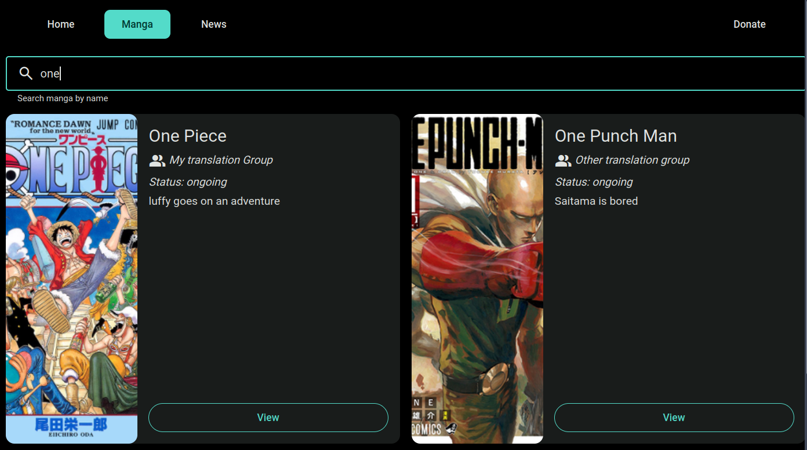

# oyori
a site for organizing manga. Built with Nim, Jester, Nimja, and HTMX.



## Instructions

```
git clone https://github.com/ajusa/oyori
cd oyori
nimble install -d
```
Fill in values for mangas.yaml, news.yaml, and donations.yaml. 

Create a file called key.txt if you wish to use Google APIs, and put your API key inside of it.

To run, do 
```
nim c -d:release main.nim
./main
```

To verify that all of the data is correct before starting the server, do
```
nim c -d:release db.nim
./db
```
